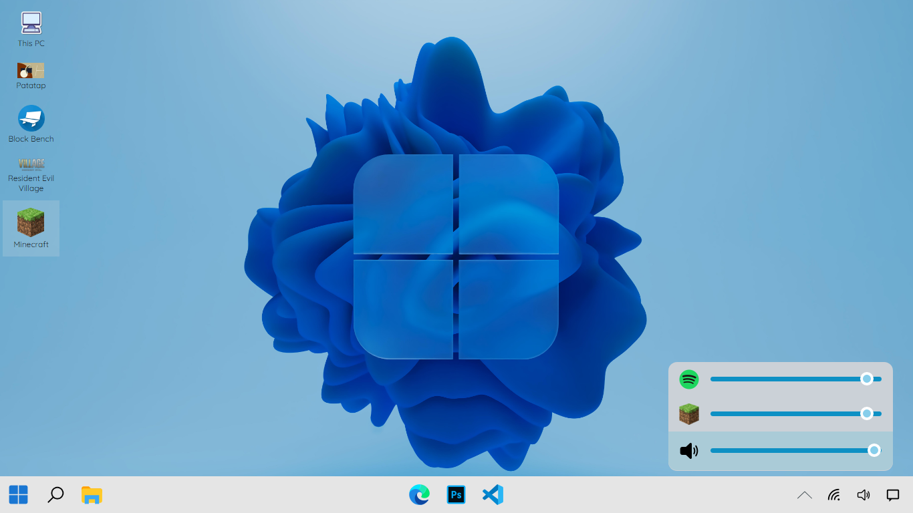

# Windows 12 Concept

#### It is app based on HTML, CSS & Javascript use to take a look of Windows 12 (Concept) in your PC/Laptop's Browser

###  Note: This is not a real software & I don't have any connection with Microsoft.

## Features

+ [x]  Start Menu with Search & Widgets
+ [x]  Volume Controller
+ [x]  Edge
+ [x]  Visual Studio Code
+ [x]  Adobe Photoshop

## Screenshots

- - - -

- - - -

- - - -

## Support Here

<h2>Thanks for Reading 😄</h2> 

