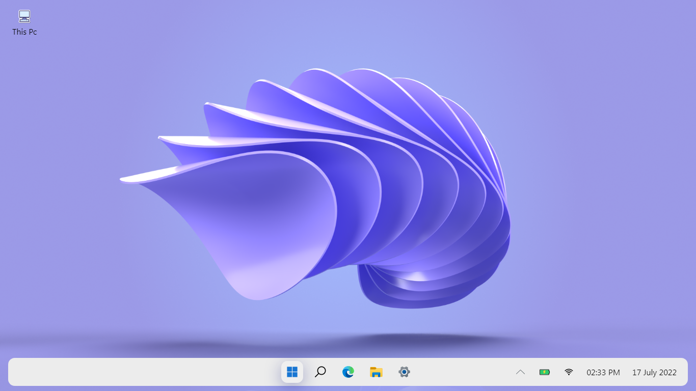
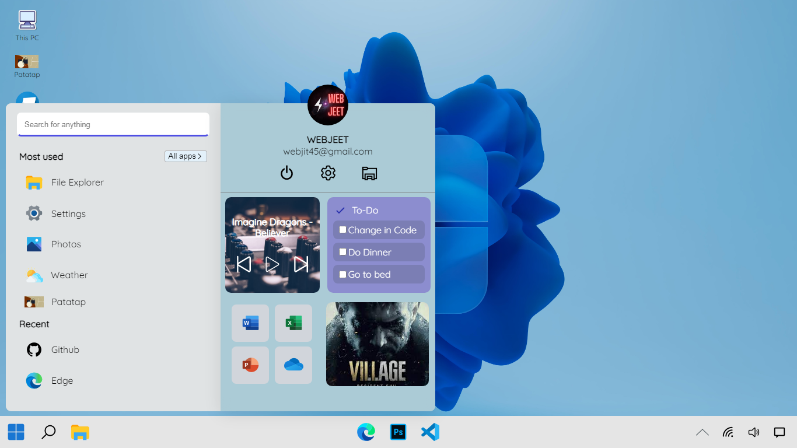

# Windows 12 Concept

#### Take a look of Microsoft's future Operating System (Windows 12) in Laptop/Desktop Browser. 

###  Note: This is not a real software & I don't have any connection with Microsoft.

## Features

+ [x]  Start Menu with Search & Widgets
+ [x]  Volume Controller
+ [x]  Edge
+ [x]  Adobe Photoshop
+ [x]  Resident Evil Village
+ [x]  Lively Wallpaper
+ [x]  Minecraft
+ [ ]  File Explorer

## Screenshots 

- - - -

## Support Here

<h2>Thanks for Reading 😄</h2> 

